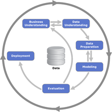

Data Science itu luas, dan banyak yang bingung mau mulai masuk dari mana. Artikel ini dibuat dengan harapan untuk menjawab kebingungan itu.

# **Intro**

## **Data Science?**

Aku yakin gak sedikit dari pembaca yang gak kebayang data science itu ngapain. Mungkin cuma pernah denger istilahnya aja karena lagi booming. Oke, kita liat istilah formalnya:

> Data science is an **inter-disciplinary** field that uses scientific methods, processes, algorithms and systems to **extract knowledge and insights** from many structural and unstructured data.
> 
> ~ Wikipedia

Intinya ada 2: *inter-disciplinary*, sama *extracting knowledge and insight*. Jadi bisa dibilang juga: 
>"memakai pengetahuan dari berbagai bidang untuk dapet ilmu dan insight dari data."

## **Case Examples**

Biar gak ngawang, di bawah ada beberapa contoh data science problem statements:

1. Given records of ticket transactions for the past month, predict how many extra tickets will be booked everyday for the next week

2. Given pictures of product and their category, build an automatic categorizer of product pictures

3. Given a number of texts and their category (containing explicit content or not), build an automatic categorizer for unlabeled texts

4. Given an image, build an image segmentation algorithm to find all the same landmarks in the image

cari lebih banyak contoh di: [Kaggle](kaggle.com), [DrivenData](drivendata.org), dan platform kompetisi lain

Memang kedengeran susah, dan emang susah, tapi di sini lah inti artikel ini: memberikan sedikit kepedean buat pembaca untuk nyobain bidang ini 

## **Tipe-Tipe Task/Problem**

Data science luas karena masalah yang tercakup di dalamnya sangat banyak. Tapi secara umum, kita bisa bikin cluster-cluster untuk permasalahan yang dibahas dalam data science, terutama terkait competitive data science:

### Pembagian Berdasarkan bentuk data yang umum dimainin

1. Tabular Data \
   Maksudnya, data disimpen dalam suatu bentuk tabel. Tipe ini yang paling mudah dibayangin prosesnya dan recommended buat yang baru masuk ke data science untuk main di sini dulu. \
   Contoh kompetisi for beginner: 
   - [Titanic](https://www.kaggle.com/c/titanic)
   - [House Price Prediction](https://www.kaggle.com/c/house-prices-advanced-regression-techniques)

2. Image Data \
   Bidang terkait ini biasa disebut *computer vision*. Contoh task-nya: mengklasifikasi suatu gambar, mendeteksi suatu objek dalam suatu gambar, atau membuat batasan objek2 dalam gambar, dll. \
   Contoh kompetisi for beginner: 
   - [Classifying Flowers](https://www.kaggle.com/c/tpu-getting-started)

3. Text Data \
   Bidang terkait ini biasa disebut *natural language processing*. Contoh task-nya: klasifikasi suatu rangkaian kata/kalimat, mengandung kata kasar atau nggak, analisis sentimen, dll. \
   Contoh kompetisi for beginner: 
   - [Detecting Fraud Tweets](https://www.kaggle.com/c/nlp-getting-started)

### Pembagian berdasarkan tipe pembelajaran
1. Supervised Learning  
   Supervised learning adalah tipe pembelajaran ketika model/algoritma mempelajari pola dari data yang sudah berlabel. Tipe pembelajaran ini adalah yang paling sering dimanfaatkan pada competitive data science. Ibaratnya kita "mengajari" model untuk membedakan bunga mawar, melati dan bugenvil dengan cara memberi gambar masing-masing bunga beserta namanya. Setelah model dirasa sudah cukup bisa mengenali karakteristik dari bunga-bunga ini maka kita bisa main tebak-tebakan dengan model ini dengan memberinya gambar tanpa diberi nama.

   Supervised learning biasanya terasosiasi dengan beberapa permasalahan populer di machine learning yaitu:
   * Regression: meminta model untuk memprediksi nilai kontinu
   * Clasification: meminta model untuk memprediksi nilai diskrit
  
2. Unsupervised Learning  
   Unsupervised learning adalah tipe pembelajaran ketika model/algoritma mempelajari pola dari data yang tidak memiliki label. Ibaratnya kita ditempatkan di satu ruangan bersama 100 orang yang belum kita kenal, kemudian kita diminta untuk mencari kesamaan masing-masing dan membentuk grup sebanyak n. Setelah terbentuk kelompok akhirnya kita baru tau nih Kelompok A ternyata kumpulan penonton drakor, Kelompok B ternyata fans berat Atta Halilintar, dan Kelompok C ternyata kumpulan orang yang tidak punya kesamaan dengan kelompok lainnya.

   Unsupervised learning biasanya terasosiasi dengan beberapa permasalahan"
   * Clustering: mengelompokkan data berdasarkan kemiripan
   * Anomaly Detection: mendeteksi keabnormalan/ hal ganjil dari data
   * Association: mencari item lain yang terasosiasi dengan item tertentu

3. Reinforcement Learning
   Reinforcement learning adalah tipe pembelajaran ketika model/algoritma/agen hanya diberikan sebuah goal dan reward tanpa diberi tahu bagaimana mencapai cara mencapai goal tersebut. Model hanya diberikan sekumpulan langkah-langkah yang boleh dilakukan dan akan mendapatkan reward apabila langkah yang dipilih menuju/mendekati goal. Sebaliknya apabila langkah yang diambil justru menjauhi goal maka agen/model diberikan punishment. Ibaratnya seperti bermain game, ketika kita berhasil menyelesaikan level maka kita akan mendapat badge sedangkan ketika kita melakukan langkah yang salah maka permainan akan berakhir.

# **Technical Skills Checklist**

## **Technical Prerequisite**
Skill-skill penting yang dibutuhin sebelum masuk ke skill spesifik data science

### 1. Basic Programming
Ini esensial banget. Bukan berarti 100% dalam data science ngoding ya, tapi Jangan masuk dulu ke data science kalo topik dasar pemrograman kayak *if-else*, *looping*, *function and procedures*, belom terlalu lancar, karena **eratnya hubungan antara data science dan programming**. Bahkan topik yang intermediate di programming seperti *object oriented programming* juga *good to have* buat lebih mudah ngerti dokumentasi dari tools-tools. Karena tanpa programming kita gak akan bisa jalan terlalu jauh

Buat milih bahasa, kalo mau main data tabular bisa pake R atau Python. Kalo mau tipe data yang lain, support buat Python jauh lebih kuat. Jadi penulis pribadi nyaranin Python aja

#### Di mana Belajarnya?
- [Codecademy](https://www.codecademy.com/)
- Youtube videos, cari: "introduction to Python", dan yang semisal
- Google

### 2. Basic Math & Statistics
Basic math di sini setidaknya ngerti operasi matriks, dan statistik dasar kayak *mean*, *standard deviation*, dsb. Gunanya itu buat ngerti konsep-konsep dasar dan supaya ketika nyusun solusi, bisa punya gambaran besar cara kerjanya gimana, bukan cuma numpuk tools doang hehe 

> Dari 2 skill di atas, penulis pribadi simpulin kalo rata-rata lulusan SMA udah cukup untuk mulai masuk ke Data Science, asal udah bisa ngoding. 
> 
> Berarti kalo secara timeline ITB, rata-rata mahasiswa ITB bisa mulai di semester 2 TPB.

#### Di mana Belajarnya?
- SMA
- [StatQuest Youtube Channel](https://www.youtube.com/channel/UCtYLUTtgS3k1Fg4y5tAhLbw)
- Googling

## **Specific Technical Skills**
Skill-skill penting yang perlu dipelajari ketika udah mulai masuk ke data science

### 1. Data Analysis Tools
Tool-tool buat analisis data. Di antaranya:
- Pandas Library for Python
- R Programming Language 

2 tool di atas sangat valuable karena berbasis programming, jadi cukup powerful untuk handle berbagai macam sumber data. Tapi bisa dipertimbangkan juga yang berbasis app seperti:

- Excel
- Tableau 

Tools-tools di atas terutama penting banget ketika ngerjain data tabular. Dan berhubung TPB semester 1 udah diajarin pandas, itu udah jadi foundation yg sangat bagus utk mulai

#### Di mana Belajarnya?
- [Kaggle Learn](http://kaggle.com/learn)
- [DataQuest](https://www.dataquest.io/)
- [DataCamp](https://www.datacamp.com/)

### 2. Basic Data Preprocessing Concepts
Proses apa aja yang dilakuin ke sebuah data. Di antara contoh istilahnya:
- Data Cleansing
- Null value handling
- Outlier handling

#### Di mana Belajarnya?
- [Kaggle Learn](http://kaggle.com/learn)
- [DataQuest](https://www.dataquest.io/)
- [DataCamp](https://www.datacamp.com/)

### 3. Basic Machine Learning Model Concepts
Kita perlu tau secara garis besar cara kerja suatu model machine learning, supaya kita bisa milih preprocessing data yang tepat untuk model itu, dan gimana caranya kita mainin (tuning) algoritmanya untuk ngasih performa optimal. Gak harus ngerti sedalem-dalemnya, cuman mungkin sebatas sampai bisa jelasin secara umum model itu gimana cara kerjanya.

#### Di mana Belajarnya?
- [Kaggle Learn](http://kaggle.com/learn)
- [StatQuest Youtube Channel](https://www.youtube.com/channel/UCtYLUTtgS3k1Fg4y5tAhLbw)
- [Machine Learning Mastery Blog](https://machinelearningmastery.com/)

### 4. Data Science Workflow
Setelah memahami konsep-konsep model machine learning maupun langkah-langkah pemrosesan data, kita perlu tau juga step-step yang biasanya dilakukan oleh para Data Scientist dari awal sampai akhir secara end-to-end. Framework paling umum yang digunakan namanya CRISP-DM. Untuk belajar lebih lanjut bisa dibaca [di sini](http://www.kuliahkomputer.com/2018/07/crisp-dm.html)

# **Softskills Checklist**
Data science sangat luas dan berhubungan dengan banyak ketidakpastian, dan dalam medan seperti itu, ada **softskill-softskill** tertentu yang berguna untuk kita miliki, di samping hardskill, ketika menyelesaikan suatu problem: 

## **a. Semangat Eksplorasi dan Belajar Mandiri** 
#### **"Apa yang belum aku tahu? Metode apa yang belum dipakai?"**

Sebagai bidang yang sangat luas, data science sering punya topik-topik baru yang muncul dengan laju yang sangat cepat. Kita gak bisa mengandalkan satu kali belajar aja untuk bisa mengerjakan semua task data science. Bahkan bisa aja  kita udah menyelesaikan kompetisi di suatu topik, dan ketika kita masuk ke kompetisi berikutnya, 90% dari kompetisi itu berisi hal baru yang kita harus pelajari. Maka mindset ***continuous learning*** jadi sangat penting dalam data science. 

## **b. Skeptis Secara Moderat**
#### **"Alur ini valid gak ya?"**

Semangat eksplorasi ada baiknya dibarengi dengan keraguan yang proporsional. Gak bisa setiap kali kita tau suatu metode baru, kemudian kita terapkan metode tersebut kepada setiap problem. Hal ini karena **setiap data, dan setiap problem mempunyai karakteristik yang berbeda**. Bahkan untuk task yang sama, misalkan memprediksi demand barang, jika tipe data dari dua buah problem berbeda, maka kita bisa aja butuh metode pemrosesan data yang berbeda, dan sangat mungkin pakai model yang berbeda. Bagaimana kita menerapkan softskill ini, bergantung kepada softskill yang ketiga.

## **c. Passion Untuk Memahami Konsep**
#### **"Ini maksudnya gimana ya? Bisa dipake di mana ya?"**

Untuk tau apakah suatu metode cocok untuk suatu persoalan, kita perlu paham secara garis besar **bagaimana metode itu bekerja**, dan **untuk tipe persoalan seperti apa** dia baiknya. Hal ini menuntut kita untuk selalu 'penasaran' tentang cara kerja dari suatu metode/library/framework yang baru kita pelajari. Gak cuma belajar cara memakai/ngodingnya saja, atau bahkan cuma copas kodenya saja. \
Note: Jangan salah, copas kode itu sangat biasa ya hehe, cuman paling nggak coba dimengerti apa maksud kodenya

# **(Possible) Learning Flow**

Data science punya banyak sekali pintu masuk, dan penulis sendiri juga percaya kalo cara belajar setiap orang sebaiknya *personalized* untuk orang tersebut. Tapi bagian ini ditulis cuma sebagai masukan, untuk menghapus sedikit kebingungan, buat mereka yang masih belum ada bayangan sama sekali dari mana mau mulai.

### **1. Belajar "secukupnya"**

Untuk sekedar masuk ke data science, penulis percaya kalo gak terlalu banyak yang harus dikuasai terlebih dahulu. Gak seperti bidang-bidang macam fisika kuantum, *quantum computing*, atau *large-scaled distributed system*, dll. Emang, bidang-bidang di data science banyak yang tingkat kompleksitasnya tinggi. Hal itu terlihat jelas kalo kita coba baca paper-paper terkini di bidang data science.

Tapi buat sekedar memulai, untuk sekedar mengikuti kompetisi atau mengerjakan proyek skala kecil, menurut penulis setidaknya cuma perlu 2 skill yang dikuasai, yaitu sebagaimana yang udah ditulis sebelumnya: **basic programming & basic math**. 

Menurut penulis poin #1 penting karena banyak hal di bidang ini yang hanya bisa dipelajari/dimengerti ketika sudah masuk langsung (*hands-on*). Jadi lebih penting untuk "masuk" dahulu dibandingkan "mempersiapkan untuk masuk".

### **2. Mulai Ngerjain Sesuatu**

Mulai ikut kompetisi-kompetisi data science, atau ngerjain proyek kecil-kecilan. Ide proyek dan implementasinya banyak banget yang bisa diambil  dari internet.

Beberapa sumber ide dan implementasi proyek:
- YouTube
- Medium
- machinelearningmastery.com

Lomba-lomba yang bisa diikuti:
- Lomba di Platform
  - Kaggle.com
   - Drivendata.org

- Lomba yang diadain lembaga (perusahaan/universitas) \
  *note: ini hanya beberapa yang pernah ada, tidak menjamin lomba ini diadakan rutin tiap tahun.
  - EY NextWave Data Challenge (diadain perusahaan konsultasi EY)
   - Shopee Code League (diadain e-commerce shopee)
   - JOINTS (UGM)
   - ITToday (IPB)
  
  Untuk HMIF ITB, bisa cari berbagai lomba yang *up-to-date* di [link ini](https://bit.ly/informasiLombaHMIF) ya, termasuk di antaranya lomba data science. Masuknya harus pake email *std.stei*

### **3. Cari Sumber-Sumber untuk Menyelesaikan Lomba atau Proyek**

Biasanya suatu lomba atau proyek punya topik/arah yang jelas. Misalkan yang satu NLP, yang satu computer vision, yang satu time series forecasting. Masing-masing bidang punya metode, proses, dan model tersendiri yang kita perlu pelajarin ketika masuk. Di tahap ini kita bisa mencari artikel/paper/tutorial yang mendukung pengerjaan itu.

### **4. Repeat #1**

3 Tahap di atas kita ulang-ulang lagi dengan ngerjain problem dan kompetisi yang bervariasi.

# **Other Great Resources**

Berikut beberapa kompilasi sumber-sumber lain yang bisa dipertimbangkan, penulis coba kelompokkan berdasarkan tipe pembelajarannya:

### 1. Hands-on
Sumber untuk latihan, berupa ide projek, kompetisi, task-task, dan dataset
- [Kaggle](http://kaggle.com)
- [UCI ML Repository](https://archive.ics.uci.edu/ml/index.php) \
   isinya berbagai dataset. Banyak yang sudah dipake di paper-paper
-  [DrivenData](https://www.drivendata.org/)
-  [Zindi](https://zindi.africa/)
-  [MLContests](https://mlcontests.com/)
  
### 2. Course
Course bisa dianggap kayak kuliah: ada materi, ada tugas, ada nilai. Di antara keuntungan course adalah pembelajaran yang terstruktur
- [Coursera](https://www.coursera.org/) \
  Popular Courses
  - [Machine Learning by Stanford University's Andrew Ng](https://www.coursera.org/learn/machine-learning)
  - [Deep Learning Specialization](https://www.coursera.org/specializations/deep-learning)
  - [Data Science Courses by IBM](https://www.coursera.org/professional-certificates/ibm-data-science)
- [Udemy](https://www.udemy.com/)
- [Udacity](https://www.udacity.com/)
- [edX](https://www.edx.org/)
- [MIT's Intro to Deep Learning](http://introtodeeplearning.com/)

### 3. Buku
Bagi yang suka fokus ke teori, dan ingin belajar dengan pace tersendiri
- Hands-On Machine Learning with Scikit-Learn, Keras, and TensorFlow: Concepts, Tools, and Techniques to Build Intelligent Systems
- [Deep Learning with PyTorch](https://pytorch.org/deep-learning-with-pytorch)
- Introduction to Statistical Learning
- Buku-buku lain dari O-Reilly biasanya terkenal

### 4. Artikel
Bisa dibilang sumber informasi yang spesifik banget terhadap suatu task. Atau, bisa jadi fokusnya lebih ke memberikan insight tentang bidang data science secara general
- [Machine Learning Mastery Blog](https://machinelearningmastery.com/)
- [Towards Data Science Medium](https://towardsdatascience.com/)
- [Analytics Vidhya](https://www.analyticsvidhya.com/blog/)
  
### 5. Tutorials
- [Tensorflow Tutorials](http://tensorflow.org/tutorials/)
- [Kaggle Learn](http://kaggle.com/learn)
- [Medium Articles](http://medium.com)
- [PyTorch Tutorials](https://pytorch.org/tutorials/)
- YouTube
  
*Note: Mayoritas library/framework machine learning punya dokumentasi yang memuat tutorial penggunaan library/framework tersebut. Makanya penting buat kita sering-sering main ke website dokumentasi.

# **Final Words**

Akhir kata, semoga guide ini bisa membantu. Gak perlu takut dan mikir "apa aku punya talent yang cukup ya?". Karena kebanyakan yang menghalangi itu bukan "kurang talent", tapi distraksi-distraksi kayak "social media", "YouTube", "Netflix", dan apapun lah itu macamnya. Motivasi dan disiplin lebih penting dalam proses belajar dibanding talent.

Terimakasih, dan selamat belajar!

# **Special Thanks to**
- Ahmad Izzan
- Christian Wibisono
- Ilham Firdausi Putra

as our first contributors! 
