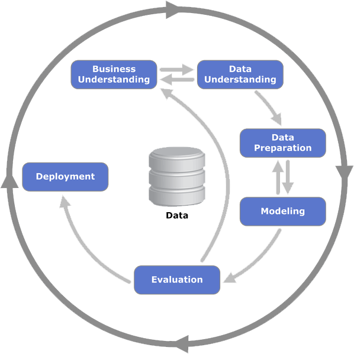
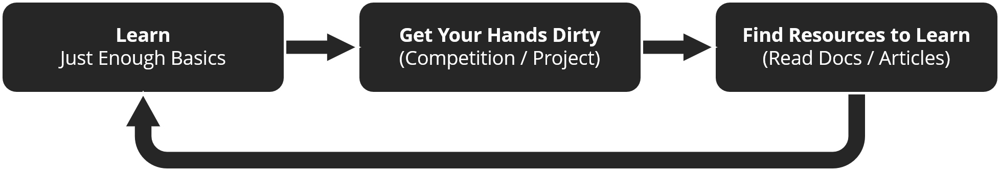

<h3 align="center">
Data Science itu luas, dan banyak yang bingung mau mulai masuk dari mana.  Artikel ini dibuat dengan harapan untuk menjawab kebingungan itu.
</h3>

 

# **Intro**

## **Data Science?**

Penulis yakin tak sedikit dari pembaca yang belum terbayang *Data Science* itu apa. Mungkin juga baru dengar istilahnya karena sedang booming. Mari kita liat istilah formalnya:

> *Data science is an **inter-disciplinary** field that uses scientific methods, processes, algorithms and systems to **extract knowledge and insights** from many structural and unstructured data.*
> 
> ~ Wikipedia

Intinya ada 2: *inter-disciplinary* dan *extracting knowledge and insight*. Jadi bisa dibilang juga: 
> Memakai pengetahuan dari berbagai bidang untuk dapat ilmu dan *insight* dari data.

## **Case Examples**

Supaya lebih terbayang, di bawah ada beberapa contoh ***Data Science Problem Statements***:

1. *Given records of ticket transactions for the past month, \
predict how many extra tickets will be booked everyday for the next week.*

2. *Given pictures of product and their category, \
build an automatic categorizer of product pictures.*

3. *Given a number of texts and their category (containing explicit content or not), \
build an automatic categorizer for unlabeled texts.*

4. *Given a set of images, \
build an image segmentation algorithm to find all the same landmarks.*

Cari contoh lainnya di [Kaggle](https://www.kaggle.com), [DrivenData](https://www.drivendata.org), [MachineHack](https://www.machinehack.com/), [Analytics Vidhya](https://www.analyticsvidhya.com/), dan platform kompetisi lain.

Terdengar sulit, dan seringkali memang tidak mudah
> Tapi disinilah kita ingin membangun confidence untuk men-tackle permasalahan-permasalahan tersebut

## **Tipe-Tipe Task/Problem**

*Data Science* luas karena masalah yang tercakup di dalamnya sangat banyak. Tapi secara umum, kita bisa buat grouping untuk permasalahan yang dibahas dalam *Data Science*, terutama terkait competitive data science:

### Berdasarkan Bentuk Data (yang Umum)

1. **Tabular Data** \
   Maksudnya, data disimpan dalam suatu bentuk tabel. 
   
   Tipe ini yang paling mudah terbayang prosesnya dan *recommended* buat yang baru masuk dan mau main-main dulu ke *Data Science*.

   Contoh kompetisi for beginner: 
   - [Titanic](https://www.kaggle.com/c/titanic)
   - [House Price Prediction](https://www.kaggle.com/c/house-prices-advanced-regression-techniques)

2. **Image Data** \
   Bidang terkait ini biasa disebut *Computer Vision*.

   Contoh task-nya antara lain:
   - mengklasifikasi suatu gambar 
   - mendeteksi suatu objek dalam suatu gambar atau 
   - membuat batasan objek2 dalam gambar, dll.
   
   Contoh kompetisi for beginner: 
   - [Classifying Flowers](https://www.kaggle.com/c/tpu-getting-started)
   - [Detecting Pneumonia](https://www.kaggle.com/paultimothymooney/chest-xray-pneumonia)

3. **Text Data** \
   Yang membahas ini biasa disebut *Natural Language Processing (NLP)*. 
   
   Contoh task-nya antara lain:
   - analisis sentimen atau klasifikasi emosi
   - aplikasi peringkasan berita
   - aplikasi mesin penerjemah, dll.

   Contoh kompetisi for beginner: 
   - [Detecting Fraud Tweets](https://www.kaggle.com/c/nlp-getting-started)
   - [News Category Prediction](https://www.kaggle.com/rohan9889/predict-news-category/code)

### Berdasarkan Tipe Pembelajaran

   

1. **Supervised Learning**

   *Supervised Learning* adalah tipe pembelajaran ketika model atau algoritma mempelajari pola dari data yang sudah berlabel. Tipe pembelajaran ini adalah yang paling sering dimanfaatkan pada *Competitive Data Science*. 
   
   Ibaratnya, kita **mengajari** model untuk membedakan yang mana bunga Mawar, Melati atau Bugenvil dengan cara memberi gambar masing-masing bunga beserta namanya. 
   
   Setelah model dirasa sudah cukup bisa mengenali karakteristik dari bunga-bunga ini maka kita bisa main tebak-tebakan dengan model ini dengan memberinya gambar bunga yang belum diketahui namanya.

   *Supervised Learning* biasanya terkait dengan beberapa permasalahan populer di *Machine Learning* yaitu:
   - **Regression**: meminta model untuk memprediksi nilai kontinu (Misal: Apakah harga=101500?, harga=201700?, dst.)
   - **Clasification**: meminta model untuk memprediksi kelas yang diskrit (Misal: Apakah kategori=perkakas, kategori=gadget, dst.)
  
2. **Unsupervised Learning**  

   *Unsupervised Learning* adalah tipe pembelajaran ketika model atau algoritma mempelajari pola dari data yang tidak memiliki label. 
   
   Ibaratnya, kita ditempatkan di satu ruangan bersama dengan 100 orang yang belum kita kenal, kemudian kita diminta untuk mencari kesamaan masing-masing dan membentuk grup sebanyak n. Setelah terbentuk kelompok, akhirnya kita baru tahu Kelompok A ternyata kumpulan penonton video masak, Kelompok B ternyata kumpulan penonton video kucing, dan Kelompok C ternyata kumpulan orang yang tidak punya kesamaan dengan kelompok lainnya.

   Unsupervised learning biasanya terkait dengan beberapa permasalahan:
   - **Clustering**: mengelompokkan data berdasarkan kemiripan
   - **Anomaly Detection**: mendeteksi keabnormalan atau hal ganjil dari data
   - **Association**: mencari item lain yang terasosiasi dengan item tertentu

3. **Reinforcement Learning**

   *Reinforcement Learning* adalah tipe pembelajaran ketika model/algoritma/agen hanya diberikan sebuah *goal* dan *reward* tanpa diberi tahu bagaimana cara mencapai *goal* tersebut.
   
   Model hanya diberikan sekumpulan langkah-langkah yang boleh dilakukan dan akan mendapatkan *reward* apabila langkah yang dipilih menuju atau mendekati *goal*.
   
   Anggap saja kita bermain bulutangkis. Ketika kita berhasil menjatuhkan kok ke wilayah lawan, maka kita akan dapat poin (reward). Ketika kita berhasil dapat poin, kita bisa belajar dari keberhasilan kita (misal: gerakan apa yang bagus, dsb.), dan ketika lawan yang dapat poin, kita bisa belajar dari kesalahan kita (misal: salah bergerak, kurang kerjasama, dsb.). Hal yang sama diterapkan ke model ML. Mereka belajar dari keberhasilan dengan diberi reward, dan belajar kesalahan dari kehilangan reward. 

# **Technical Skills Checklist**

## **Technical Prerequisite**

*Skills* penting yang dibutukan sebelum masuk ke *Skill* yang lebih spesifik untuk *Data Science* (Section "Specific Technical Skills")

### **1. Basic Programming**

Ini sangat pondasi. Bukan berarti 100% dalam *Data Science* itu skill programming, ya. Tapi lebih baik jangan masuk ke *Data Science* jika topik dasar pemrograman seperti *if-else*, *looping*, *function and procedures*, belum terlalu lancar, karena **eratnya hubungan antara *Data Science* dan *Programming***. Bahkan topik yang *intermediate* di *programming* seperti *Object Oriented Programming (OOP)* juga **good to have**  agar lebih mudah paham dokumentasi dari berbagai *tools* yang ada. Tanpa ilmu *programming*, kita tak akan bisa berjalan terlalu jauh atau menyelam terlalu dalam.

Terkait bahasa pemrograman, umumnya untuk data tabular bisa pakai R atau Python. Untuk tipe data yang lain, *support* untuk Python jauh lebih kuat. Jadi penulis pribadi menyarankan **Python**.

#### **Di mana Belajarnya?**
- [Youtube](https://www.youtube.com/) dan [Google](https://www.google.com/) (Cari "*Introduction to Python*" atau yang semisal)
- [Codecademy](https://www.codecademy.com/)
- [W3Schools](https://www.w3schools.com/)
- [FreeCodeCamp](https://www.freecodecamp.org/)
- [Khan Academy](https://www.khanacademy.org/)

### **2. Basic Math & Statistics**

*Basic Math* di sini setidaknya paham operasi matriks, dan **statistik dasar** seperti *mean*, *standard deviation*, dsb. Gunanya untuk mengerti konsep-konsep dasar dan ketika menyusun solusi, bisa punya gambaran besar bagaimana cara kerjanya, dan tidak hanya sembarang pakai *tools* 

> Dari 2 skill di atas, penulis pribadi simpulkan kalau rata-rata lulusan SMA sudah cukup untuk mulai masuk ke *Data Science*, selama sudah paham pemrograman. 

> Berarti secara *timeline* ITB, rata-rata mahasiswa ITB bisa mulai di semester 2 TPB.

#### **Di mana Belajarnya?**
- SMA
- [Youtube](https://www.youtube.com/) dan [Google](https://www.google.com/) (Cari "*Basic Statistics*" atau yang semisal)
- [StatQuest Youtube Channel](https://www.youtube.com/channel/UCtYLUTtgS3k1Fg4y5tAhLbw)
- [Coursera - Basic Statistics](https://www.coursera.org/courses?query=basic%20statistics)
- [FreeCodeCamp - Statistics for Data Science](https://www.freecodecamp.org/news/statistics-for-data-science/)

## **Specific Technical Skills**
*Skills* penting yang perlu dipelajari ketika sudah mulai masuk ke *Data Science*

### **1. Data Analysis Tools**

*Tools* untuk analisis data. Di antaranya:
- *Pandas Library for Python*
- *R Programming Language* 

Dua *tools* di atas sangat *valuable* karena berbasis *programming*, jadi cukup *powerful* untuk meng-*handle* berbagai macam sumber data. Tapi bisa dipertimbangkan juga yang berbasis *app* seperti:

- Excel
- Tableau
- Power BI
- Google DS

Tools di atas terutama penting ketika handle data tabular. Berhubung sekarang TPB semester 1 sudah belajar pandas, itu jadi pondasi yg sangat bagus utk mulai.

#### Di mana Belajarnya?
- [Kaggle Learn](http://kaggle.com/learn)
- [DataQuest](https://www.dataquest.io/)
- [DataCamp](https://www.datacamp.com/)

### **2. Basic Data Preprocessing Concepts**

Proses apa aja yang dilakuin ke sebuah data. Di antara contoh istilahnya:
- *Data Cleansing*
- *Null or Missing Value Handling*
- *Outlier Handling*
- *Remove Duplicate*
- *Normalization*

#### Di mana Belajarnya?
- [Kaggle Learn](http://kaggle.com/learn)
- [DataQuest](https://www.dataquest.io/)
- [DataCamp](https://www.datacamp.com/)

### **3. Basic Machine Learning Model Concepts**
Kita perlu paham secara garis besar cara kerja suatu model *Machine Learning*, agar kita bisa memilih *preprocessing* data yang tepat untuk model itu, dan bagaimana caranya kita bisa mainkan (*tuning*) algoritmanya untuk hasilkan performa optimal. Tidak harus paham sampai seluk-beluknya, namun di awal, cukup bisa paham intuisi bagaimana modelnya bekerja.

#### Di mana Belajarnya?
- [Kaggle Learn](http://kaggle.com/learn)
- [StatQuest Youtube Channel](https://www.youtube.com/channel/UCtYLUTtgS3k1Fg4y5tAhLbw)
- [Machine Learning Mastery Blog](https://machinelearningmastery.com/)

### **4. Data Science Workflow**
Setelah memahami konsep-konsep model *Machine Learning* maupun langkah-langkah pemrosesan data, kita perlu tau juga step-step yang biasanya dilakukan oleh para *Data Scientist* dari awal sampai akhir secara end-to-end. Framework paling umum yang digunakan namanya **CRISP-DM**. Untuk belajar lebih lanjut bisa dibaca [di sini](http://www.kuliahkomputer.com/2018/07/crisp-dm.html)

   

# **Softskills Checklist**
*Data Science* sangat luas dan berhubungan dengan banyak ketidakpastian, dan dalam medan seperti itu, ada ***softskills*** tertentu yang berguna untuk kita miliki, di samping hardskill, ketika tackle sebuah masalah: 

## **a. Semangat Eksplorasi dan Belajar Mandiri** 

**"Apa yang belum aku tahu? Metode apa yang belum dipakai?"**

Sebagai bidang yang sangat luas, *Data Science* sering punya topik-topik baru yang muncul dengan laju yang sangat cepat. Kita tak bisa mengandalkan satu kali belajar aja untuk bisa mengerjakan semua task *Data Science*. 

Bahkan sangat mungkin kita menyelesaikan kompetisi di suatu topik, dan ketika kita masuk kompetisi berikutnya, 90% dari kompetisi itu berisi hal baru yang kita harus pelajari. Maka mindset ***continuous learning*** sangat penting dalam *Data Science*. 

## **b. Skeptis secara Moderat**

**"Alur ini valid gak ya?"**

Semangat eksplorasi ada baiknya dibarengi dengan keraguan yang proporsional. Tak bisa setiap kali kita paham metode baru, kemudian kita terapkan metode tersebut kepada setiap *problem*. Hal ini karena **setiap data, dan setiap *problem* mempunyai karakteristik yang berbeda**.

 Bahkan untuk *task* yang sama, misalkan memprediksi *demand* barang, jika tipe data dari dua buah *problem* berbeda, maka kita bisa saja butuh metode pemrosesan data yang berbeda, dan sangat mungkin pakai model yang berbeda. Bagaimana kita menerapkan *softskill* ini, bergantung kepada *softskill* yang ketiga.

## **c. Passion untuk Memahami Konsep**

**"Ini maksudnya gimana ya? Bisa dipake di mana ya?"**

Untuk paham apakah suatu metode cocok untuk suatu persoalan, kita perlu paham secara garis besar **bagaimana metode itu bekerja**, dan **untuk tipe persoalan seperti apa** dia baiknya. Hal ini menuntut kita untuk selalu '**penasaran**' tentang intuisi dari suatu metode/library/framework yang baru kita pelajari. Tak hanya belajar cara memakai/ngodingnya saja, atau bahkan cuma **copas** kodenya saja.

# **(Possible) Learning Flow**

 

*Data Science* punya banyak sekali pintu masuk, dan penulis sendiri juga percaya kalau cara belajar setiap orang sebaiknya *personalized*. Tapi bagian ini ditulis hanya sebagai masukan, agar yang belum masuk bisa ambil salah satu pintu.

### **1. Belajar "Secukupnya"**

Untuk sekedar masuk ke *Data Science*, penulis percaya bahwa tidak terlalu banyak yang harus dikuasai terlebih dahulu. Tidak seperti fisika kuantum, *quantum computing*, *distributed systems*, dll. Memang, bidang-bidang di *Data Science* banyak yang tingkat kompleksitasnya tinggi. Hal itu terlihat jelas kalo kita coba baca paper-paper terkini di bidang *Data Science*.

Tapi untuk sekedar memulai, atau untuk sekedar mengikuti kompetisi skala kecil, menurut penulis setidaknya hanya perlu 2 skill yang dikuasai, yaitu sebagaimana yang ada di section sebelumnya: **Basic Programming dan Basic Math**. 

Menurut penulis poin **#1** penting karena banyak hal di bidang ini yang hanya bisa dipelajari/dimengerti ketika sudah masuk langsung (*hands-on*). Jadi lebih penting untuk "**masuk**" dahulu dibandingkan "**mempersiapkan untuk masuk**".

### **2. Mulai Kerjakan Sesuatu**

Mulai ikut kompetisi-kompetisi *Data Science*, atau proyek kecil-kecilan. Ide proyek dan implementasinya sangat banyak di internet.

Beberapa sumber ide dan implementasi proyek:
- [YouTube](https://www.youtube.com/)
- [Medium](https://medium.com/)
- [Machine Learning Mastery](https://machinelearningmastery.com/)

Lomba-lomba yang bisa diikuti:
- Lomba di Platform
   - [Kaggle](https://www.kaggle.com)
   - [DrivenData](https://www.drivendata.org)
   - [Analytics Vidhya](https://www.analyticsvidhya.com/)

- Lomba yang diadakan lembaga (perusahaan/universitas) \
  **Note**: ini hanya beberapa yang pernah ada, tidak menjamin lomba ini diadakan rutin tiap tahun.
   - EY NextWave Data Challenge (diadakan perusahaan consulting EY)
   - Shopee Code League (diadakan Shopee)
   - JOINTS (UGM)
   - ITToday (IPB)
  
  Untuk **HMIF ITB**, bisa cari berbagai lomba yang *up-to-date* di [link ini](https://bit.ly/informasiLombaHMIF) ya, termasuk di antaranya lomba *Data Science*. Masuknya perlu pake email *std.stei*

### **3. Cari Sumber-Sumber untuk Menyelesaikan Lomba atau Proyek**

Biasanya suatu lomba atau proyek punya topik/arah yang jelas. Misalkan yang satu NLP, yang satu *Computer Vision*, yang satu *Time Series Forecasting*. Masing-masing bidang punya metode, proses, dan model tersendiri yang kita perlu pelajari ketika masuk. Di tahap ini kita bisa mencari artikel/paper/tutorial yang mendukung pengerjaan itu.

### **4. Repeat #1**

3 Tahap di atas kita ulang-ulang lagi dengan *problem* dan kompetisi yang bervariasi.

# **Other Great Resources**

Berikut beberapa kompilasi sumber-sumber lain yang bisa dipertimbangkan, penulis coba kelompokkan berdasarkan tipe pembelajarannya:

### **1. Hands-on**

Sumber untuk latihan, berupa ide projek, kompetisi, task-task, dan dataset

- [Kaggle](http://kaggle.com)
- [UCI ML Repository](https://archive.ics.uci.edu/ml/index.php) (berisi berbagai dataset, yang dipakai di paper)
- [DrivenData](https://www.drivendata.org/)
- [Zindi](https://zindi.africa/)
- [MLContests](https://mlcontests.com/)
- [arXiv](https://arxiv.org/) (berisi ribuan *Research Papers*, *include Code and Dataset*)
  
### **2. Course**

Course bisa dianggap kuliah: ada materi, ada tugas, ada nilai. Di antara keuntungan course adalah pembelajaran yang terstruktur

- [Coursera](https://www.coursera.org/) \
  Popular Courses
  - [Machine Learning by Stanford University's Andrew Ng](https://www.coursera.org/learn/machine-learning)
  - [Deep Learning Specialization](https://www.coursera.org/specializations/deep-learning)
  - [Data Science Courses by IBM](https://www.coursera.org/professional-certificates/ibm-data-science)
- [Udemy](https://www.udemy.com/)
- [Udacity](https://www.udacity.com/)
- [edX](https://www.edx.org/)
- [MIT's Intro to Deep Learning](http://introtodeeplearning.com/)

### **3. Buku**

Bagi yang suka fokus ke teori, dan ingin belajar dengan *pace* tersendiri.

- Hands-On Machine Learning with Scikit-Learn, Keras, and TensorFlow: Concepts, Tools, and Techniques to Build Intelligent Systems
- [Deep Learning with PyTorch](https://pytorch.org/deep-learning-with-pytorch)
- Introduction to Statistical Learning
- Buku-buku lain dari O-Reilly biasanya terkenal

### **4. Artikel**
Bisa dibilang sumber informasi yang spesifik banget terhadap suatu *task* atau bisa jadi fokusnya lebih ke memberikan *insight* tentang bidang *Data Science* secara umum.

- [Machine Learning Mastery Blog](https://machinelearningmastery.com/)
- [Towards Data Science Medium](https://towardsdatascience.com/)
- [Analytics Vidhya](https://www.analyticsvidhya.com/blog/)
  
### **5. Tutorials**
- [Tensorflow Tutorials](http://tensorflow.org/tutorials/)
- [Kaggle Learn](http://kaggle.com/learn)
- [Medium Articles](http://medium.com)
- [PyTorch Tutorials](https://pytorch.org/tutorials/)
- [YouTube](https://www.youtube.com/)
  
**Note**: Mayoritas *library/framework Machine Learning* punya dokumentasi yang memuat tutorial penggunaan *library/framework* tersebut. Makanya penting buat kita sering-sering main ke *website* dokumentasi.

# **Final Words**

Akhir kata, semoga guide ini bisa membantu. Tak perlu takut dan mikir "apa aku punya talent yang cukup ya?". Karena kebanyakan yang menghalangi itu bukan "kurang talent", tapi distraksi-distraksi yang ada di sekitar kita. Motivasi dan disiplin akan lebih berpengaruh dalam proses belajar dibandingkan talent.

Terima kasih dan selamat belajar!

# **Ucapan Terima Kasih**
- Ahmad Izzan
- Christian Wibisono
- Ilham Firdausi Putra
   
Sebagai kontributor-kontributor awal! 
   
- CnC HMIF ITB sebagai pendorong pertama ditulisnya artikel ini
- Seluruh kontributor langsung maupun tak langsung di repository ini
